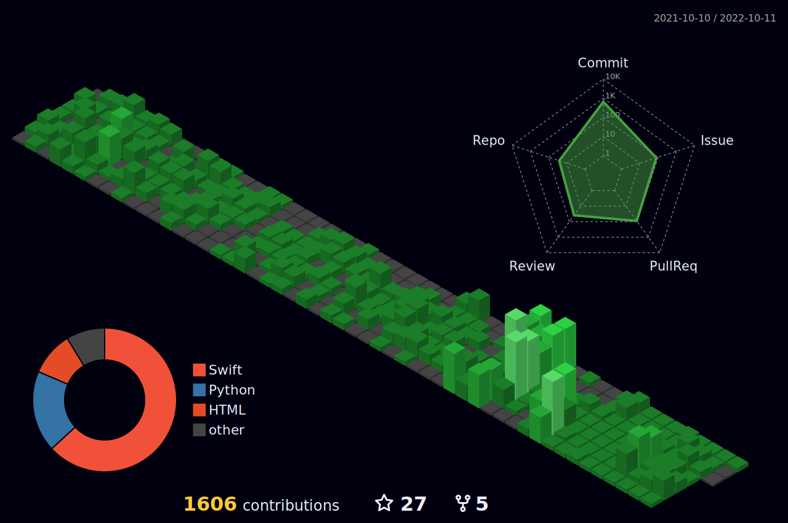

 

### Recent Post...

[[RxSwift] flatMapLatest (feat. flatMap)](https://limjs-dev.tistory.com/140) - Aug 09, 2022 
[[RxSwift] map vs flatMap](https://limjs-dev.tistory.com/139) - Aug 09, 2022 
[[iOS] View Drawing Cycle (Layout까지 작성함)](https://limjs-dev.tistory.com/138) - Aug 07, 2022 
[[Xcode] 단축키 좀 써주세요...](https://limjs-dev.tistory.com/137) - Aug 06, 2022 
[[RxSwift] RxDataSources 사용해보기](https://limjs-dev.tistory.com/136) - Aug 02, 2022 
[[Design Pattern] Coordinator Pattern](https://limjs-dev.tistory.com/135) - Jul 29, 2022 
[README Github Action 적용기](https://limjs-dev.tistory.com/134) - Jul 29, 2022 
[[Architectures] MVVM + Clean Architecture (feat. ReactorKit)](https://limjs-dev.tistory.com/133) - Jul 26, 2022 
[[RxSwift] concat](https://limjs-dev.tistory.com/132) - Jul 26, 2022 
[[Swift] defer](https://limjs-dev.tistory.com/131) - Jun 10, 2022 
